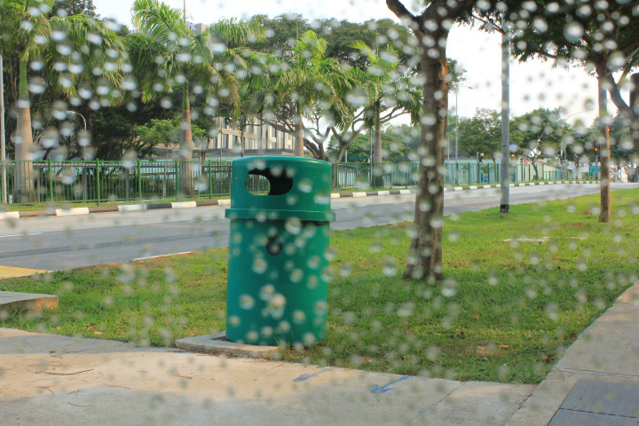
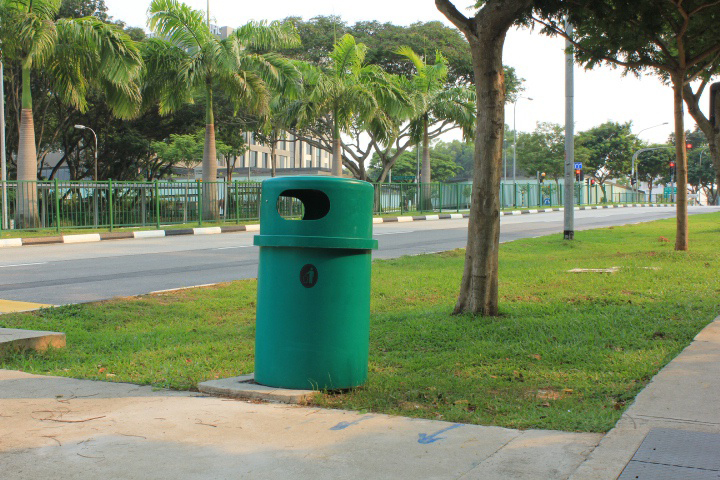
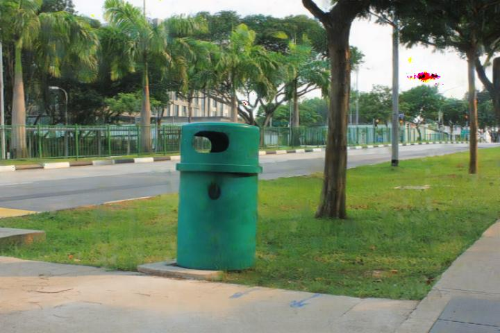

# Image-Restoration-Raindrop-Removal

This is a final project for the course Computer Vision (CS231). We need a deep learning model that can restore rain damaged images. For this, we refer to the architecture of this [paper](https://arxiv.org/abs/1711.10098).

Our goal is to create a model that can restore images similar to the paper method with lower computational cost and good enough quality of restored images. Instead of calculating convolution as usual, we use DSConv technique to reduce computational cost and number of parameters.

<h3>Compare the performances of GAN with DSConv and Conv2D: </h3>

<table>
  <tr>
    <th></th>
    <th>Avg PSNR</th>
    <th>Avg SSIM</th>
    <th>Avg LPIPS</th>
    <th>Avg time (s)</th>
  </tr>
  <tr>
    <td><strong>GAN-DSConv</strong></td>
    <td>23.5764</td>
    <td>0.8310</td>
    <td>0.1506</td>
    <td><mark>0.0162</mark></td>
  </tr>
  <tr>
    <td><strong>GAN-Conv2D</strong></td>
    <td><mark>25.5209</mark></td>
    <td><mark>0.8647</mark></td>
    <td><mark>0.0956</mark></td>
    <td>0.0296</td>
  </tr>
</table>

<h3> Examples:</h3>

<table>
  <tr>
    <td align="center">
       
      Input
    </td>
    <td align="center">
       
      Ground Truth
    </td>
  </tr>
  <tr>
    <td align="center">
       
      Baseline
    </td>
    <td align="center">
       
      DSConv
    </td>
  </tr>
</table>

<table>
  <tr>
    <td align="center">
       
      Input
    </td>
    <td align="center">
       
      Ground Truth
    </td>
  </tr>
  <tr>
    <td align="center">
       
      Baseline
    </td>
    <td align="center">
       
      DSConv
    </td>
  </tr>
</table>

